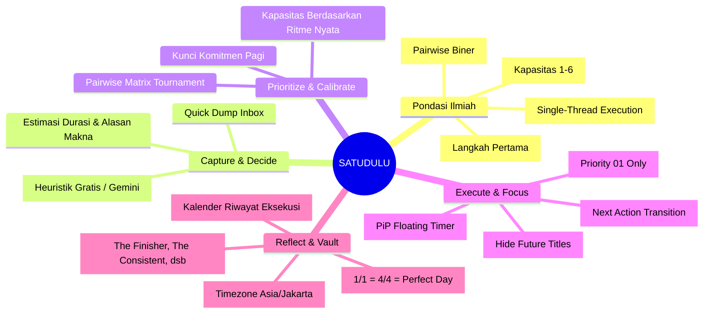
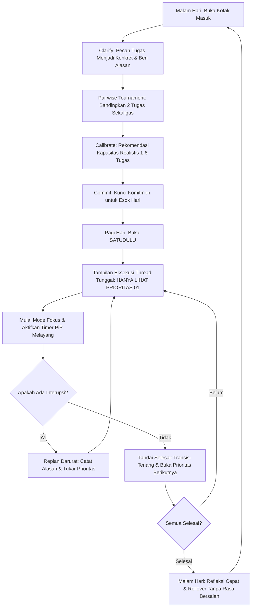
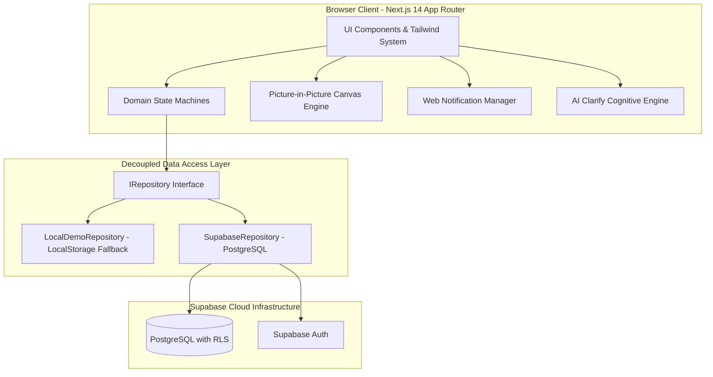
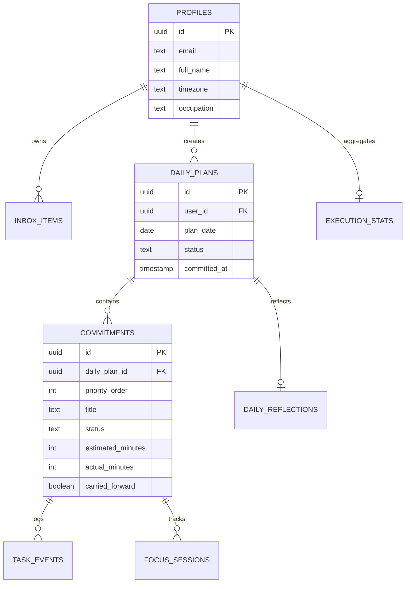

# SATUDULU

<p align="center">
  <strong>"Decide what matters. Do it one at a time."</strong><br>
  <em>Sistem Eksekusi Personal Berbasis Psikologi Kognitif untuk Pelajar & Pekerja Pengetahuan</em>
</p>

<p align="center">
  
  
  
  
  
  
</p>

---

## Daftar Isi

1. [Executive Summary & Problem Statement](#1-executive-summary--problem-statement)
2. [Pondasi Riset Ilmiah (Scientific Foundations)](#2-pondasi-riset-ilmiah-scientific-foundations)
3. [Mindmap Produk & Siklus Perilaku](#3-mindmap-produk--siklus-perilaku)
4. [Sketsa Wireframe & Arsitektur Fitur](#4-sketsa-wireframe--arsitektur-fitur)
5. [Tabel Komparasi Inovasi (Unique Selling Points)](#5-tabel-komparasi-inovasi-unique-selling-points)
6. [Arsitektur Sistem & Rekayasa Perangkat Lunak](#6-arsitektur-sistem--rekayasa-perangkat-lunak)
7. [Skema Basis Data (Database Schema & RLS)](#7-skema-basis-data-database-schema--rls)
8. [Panduan Instalasi & Menjalankan Aplikasi](#8-panduan-instalasi--menjalankan-aplikasi)
9. [Pengujian & Verifikasi Mutu](#9-pengujian--verifikasi-mutu)

---

## 1. Executive Summary & Problem Statement

### Paradoks Aplikasi To-Do Tradisional

Hampir semua aplikasi produktivitas konvensional (Todoist, TickTick, Apple Reminders, Trello) didesain sebagai **gudang penampung tugas tanpa batas** (*infinite task hoarding*). Akibatnya:

- **Cognitive Thrashing & Decision Fatigue**: Pengguna membuka aplikasi dan langsung disajikan 20-30 daftar tugas. Otak dipaksa memilih ulang apa yang harus dikerjakan setiap saat.
- **Overplanning & Ilusi Produktivitas**: Pengguna menghabiskan waktu berjam-jam merapikan tag, kategori, dan warna tanpa pernah benar-benar mengeksekusi tugas.
- **Guilt & Shame Rollover**: Tugas yang tidak selesai dicap merah dengan label *"Overdue"*, menimbulkan rasa bersalah yang berujung pada pengabaian aplikasi (*productivity abandonment*).
- **Constant Context Switching**: Melihat tugas lain saat sedang mengerjakan satu hal memicu kecemasan kognitif (*attention residue*).

### Solusi: SATUDULU

**SATUDULU** bukan sekadar to-do list. SATUDULU adalah **Personal Execution System** (Sistem Eksekusi Pribadi) yang dirancang untuk melindungi atensi dan energi mental pengguna melalui prinsip **Thread Tunggal (Single-Thread Execution)**:

1. **Satu Hal dalam Satu Waktu**: Di layar eksekusi, pengguna **hanya melihat Prioritas 01**. Judul tugas berikutnya sengaja disembunyikan.
2. **Kapasitas Adaptif (1–6 Komitmen)**: Batas maksimal 6 komitmen harian bukanlah target atau kuota, melainkan batas aman kognitif.
3. **Rollover Tanpa Rasa Bersalah**: Tugas yang belum terselesaikan tidak dianggap gagal; statusnya dialihkan ke `carried_forward` untuk dievaluasi ulang esok hari dengan tenang.
4. **Keputusan Tanpa Beban**: Algoritma komparasi biner (Pairwise Prioritization) membantu mengurutkan prioritas tanpa membebani pikiran.

---

## 2. Pondasi Riset Ilmiah (Scientific Foundations)

SATUDULU dibangun di atas 6 teori psikologi kognitif dan perilaku yang telah tervalidasi secara empiris:

```
+---------------------------------------------------------------------------------------------------+
|                                 PONDASI RISET ILMIAH SATUDULU                                     |
+------------------------------------+--------------------------------------------------------------+
| Teori & Peneliti                   | Penerapan Arsitektur & Desain pada SATUDULU                  |
+------------------------------------+--------------------------------------------------------------+
| 1. Miller's Law (1956)             | Batas kapasitas memori kerja 7±2 informasi. SATUDULU         |
|    George A. Miller                | membatasi komitmen harian maksimal 6 (rekomendasi 3-4).      |
+------------------------------------+--------------------------------------------------------------+
| 2. Ego Depletion (1998)            | Energi kemauan (*willpower*) terkuras oleh keputusan berulang.|
|    Roy Baumeister et al.           | Menggunakan Pairwise Biner (A vs B) untuk memangkas kelelahan.|
+------------------------------------+--------------------------------------------------------------+
| 3. Implementation Intentions (1999)| Rencana jika-maka (*if-then planning*) melipatgandakan       |
|    Peter Gollwitzer                | eksekusi. Fitur Clarify mewajibkan "Langkah Pertama Spesifik".|
+------------------------------------+--------------------------------------------------------------+
| 4. Goal-Setting Theory (2002)      | Kejelasan satu target spesifik menghasilkan performa 2x lebih|
|    Edwin Locke & Gary Latham       | tinggi dibanding instruksi umum "lakukan yang terbaik".      |
+------------------------------------+--------------------------------------------------------------+
| 5. Planning Fallacy (1979)         | Manusia secara konsisten meremehkan waktu penyelesaian.       |
|    Daniel Kahneman & Amos Tversky  | Sistem kalibrasi adaptif menghitung histori ritme nyata.      |
+------------------------------------+--------------------------------------------------------------+
| 6. Flow State (1990)               | Fokus mendalam tercapai saat bebas dari gangguan antrean.    |
|    Mihaly Csikszentmihalyi         | Mode Fokus Single-Thread menyembunyikan tugas masa depan.    |
+------------------------------------+--------------------------------------------------------------+
```

---

## 3. Mindmap Produk & Siklus Perilaku

### High-Level Product Mindmap



### Siklus Perilaku Harian Pengguna (The Daily Execution Loop)



---

## 4. Sketsa Wireframe & Arsitektur Fitur

### Sketsa 1: Landing Page (Bubble Header & Ambient Backdrop)

```
+-------------------------------------------------------------------------+
|                              [ S A T U D U L U ]                        |
|        [Filosofi]   [Riset Ilmiah]   [Panduan]   [Buka Aplikasi ->]     |  <- Floating Bubble Navbar
+-------------------------------------------------------------------------+
|                                                                         |
|                       SATU HAL DALAM SATU WAKTU                         |
|             Sistem Eksekusi Personal Berbasis Psikologi Kognitif        |
|                                                                         |
|                [ Mulai Komitmen Hari Ini ]   [ Baca Riset ]             |
|                                                                         |
|   +-------------------+  +--------------------+  +------------------+   |
|   | 1. Thread Tunggal |  | 2. Pairwise Biner  |  | 3. Bebas Bersalah|   |
|   | Hanya lihat fokus |  | Memilih A vs B     |  | Rollover tenang |   |
|   | aktif saat ini.   |  | tanpa overthinking |  | tanpa label gagal|   |
|   +-------------------+  +--------------------+  +------------------+   |
|                                                                         |
+-------------------------------------------------------------------------+
```

### Sketsa 2: Eksekusi Thread Tunggal & PiP Floating Timer (`/app`)

```
+-------------------------------------------------------------------------+
| SATUDULU          [Hari Ini]   [Kotak Masuk]   [Rencana]   [The Vault]  |
+-------------------------------------------------------------------------+
|                                                                         |
|  STATUS KOMITMEN: TERKUNCI (PAGI HARI)                 [Replan Darurat] |
|  PROGRES: ● ○ ○                                        Ritme: 1/3 Tugas |
|                                                                         |
|  +-------------------------------------------------------------------+  |
|  |  PRIORITAS 01 (SEDANG DIKERJAKAN)                                  |  |
|  |                                                                   |  |
|  |  Selesaikan draf Bab 3 Metodologi Penelitian                      |  |
|  |  Estimasi: 45 Menit  |  Alasan: Agar siap bimbingan dosen Kamis  |  |
|  |                                                                   |  |
|  |  [ SELESAIKAN KOMITMEN INI ]    [ MASUK MODE FOKUS ]              |  |
|  +-------------------------------------------------------------------+  |
|                                                                         |
|  KOMITMEN MENDATANG (2 TUGAS TERJAGA)                                   |
|  +-------------------------------------------------------------------+  |
|  |  [Gembok] Prioritas 02  -  Judul disembunyikan untuk menjaga atensi|  |
|  |  [Gembok] Prioritas 03  -  Judul disembunyikan untuk menjaga atensi|  |
|  +-------------------------------------------------------------------+  |
|                                                                         |
+-------------------------------------------------------------------------+
               \
                \--> [ PiP Floating Canvas Overlay di atas VS Code/Word ]
                     +---------------------------------------+
                     | SATUDULU FOCUS TIMER     [X]           |
                     | Prioritas 01: Draf Bab 3 Metodologi   |
                     | 00:34:12                              |
                     | [Jeda]  [Selesai]                     |
                     +---------------------------------------+
```

### Sketsa 3: Pairwise Prioritization Engine (`/app/plan`)

```
+-------------------------------------------------------------------------+
|                  MANA YANG LEBIH PENTING UNTUK BESOK?                  |
|               Perbandingan 3 dari 6  |  Tekan A atau B                   |
+-------------------------------------------------------------------------+
|                                                                         |
|       +---------------------------+   +---------------------------+     |
|       |          PILIHAN A        |   |          PILIHAN B        |     |
|       |                           |   |                           |     |
|       | Review pull request auth  |   | Siapkan slide presentasi  |     |
|       | service sebelum release   |   | investor meeting          |     |
|       |                           |   |                           |     |
|       |      [ PILIH INI (A) ]    |   |      [ PILIH INI (B) ]    |     |
|       +---------------------------+   +---------------------------+     |
|                                                                         |
|                      [ Keduanya Sama Penting ]                          |
+-------------------------------------------------------------------------+
```

---

## 5. Tabel Komparasi Inovasi (Unique Selling Points)

| Fitur / Paradigma | Aplikasi To-Do Biasa (Todoist, Notion, Reminders) | SATUDULU (Personal Execution System) |
| :--- | :--- | :--- |
| **Model Tampilan Tugas** | Daftar panjang 20-50 item sekaligus (*cognitive overload*). | **Single-Thread**: Hanya 1 tugas aktif; tugas berikutnya disembunyikan. |
| **Penentuan Prioritas** | Drag-and-drop manual yang memicu kebingungan. | **Pairwise Biner Tournament**: Otak hanya membandingkan 2 opsi sekaligus. |
| **Kapasitas Harian** | Tidak terbatas (*unlimited hoarding*). | **Batas Adaptif 1–6 Komitmen** berbasis riwayat kecepatan nyata. |
| **Tugas Belum Selesai** | Ditandai merah sebagai "Overdue / Gagal" (*guilt-inducing*). | **Zero-Guilt Rollover**: Masuk ke evaluasi esok hari tanpa rasa bersalah. |
| **Bantuan Perjelas Tugas** | Kosong atau bergantung prompt AI generik berbayar. | **Dual-Tier AI Clarifier**: Heuristik kognitif gratis otomatis + Gemini Flash. |
| **Timer Fokus Saat Bekerja** | Harus buka tab browser terus-menerus. | **Picture-in-Picture (PiP)**: Timer melayang native di atas app lain. |
| **Etika Gamifikasi** | Poin palsu, avatar kartun, dan emoji berlebihan. | **Meaningful Metrics**: Rasio selesai (1/1 = 4/4 = Perfect Day), zero emojis. |

---

## 6. Arsitektur Sistem & Rekayasa Perangkat Lunak

### Diagram Arsitektur Komponen



### Standar Rekayasa Perangkat Lunak

- **Strict TypeScript**: Bebas dari tipe `any`. Seluruh entitas model (`Commitment`, `DailyPlan`, `InboxItem`, `FocusSession`) didefinisikan secara tegas.
- **Clean Architecture Repository Pattern**: Logika bisnis aplikasi sepenuhnya terisolasi dari basis data melalui antarmuka `IRepository`. Aplikasi dapat berjalan offline secara instan melalui `LocalDemoRepository` atau terhubung ke `SupabaseRepository`.
- **Zero External UI Library Bloat**: Komponen modal, tombol, badge, dan kartu dibangun secara murni menggunakan Tailwind CSS dan Lucide Icons tanpa ketergantungan library berat.
- **Cross-Browser Picture-in-Picture**: Menggunakan kombinasi HTML5 Canvas `captureStream()` dan video element untuk memastikan fitur timer melayang berjalan di Google Chrome, Microsoft Edge, dan Safari.

---

## 7. Skema Basis Data (Database Schema & RLS)

Skema database PostgreSQL telah dioptimalkan dengan Row Level Security (RLS) di `supabase/migrations/20260918000001_initial_schema.sql`:



---

## 8. Panduan Instalasi & Menjalankan Aplikasi

### Kebutuhan Sistem
- **Node.js**: v18.17.0 atau lebih baru
- **npm** atau **pnpm**

### Langkah 1: Kloning Repositori
```bash
git clone https://github.com/FadliBilal/satu-dulu.git
cd satu-dulu
```

### Langkah 2: Pasang Dependensi
```bash
npm install
```

### Langkah 3: Jalankan Mode Pengujian
```bash
npm test
```

### Langkah 4: Jalankan Development Server
```bash
npm run dev
```
Buka peramban Anda di [http://localhost:3000](http://localhost:3000).

### Langkah 5: Konfigurasi Supabase (Opsional)
Jika ingin menghubungkan ke database cloud PostgreSQL:
1. Buat proyek baru di [supabase.com](https://supabase.com).
2. Jalankan skrip SQL di file `supabase/migrations/20260918000001_initial_schema.sql` pada SQL Editor Supabase.
3. Buat file `.env.local`:
   ```env
   NEXT_PUBLIC_SUPABASE_URL=https://proyek-anda.supabase.co
   NEXT_PUBLIC_SUPABASE_ANON_KEY=kunci-anon-anda
   ```
4. Restart server. Sistem otomatis beralih ke cloud PostgreSQL dengan otentikasi aman.

---

## 9. Pengujian & Verifikasi Mutu

Seluruh logika bisnis inti diuji menggunakan **Vitest** dengan tingkat keberhasilan 100%:

```
 ✓ tests/domain/rollover.test.ts (2 tests)
 ✓ tests/domain/pairwise.test.ts (3 tests)
 ✓ tests/domain/state-machine.test.ts (7 tests)
 ✓ tests/domain/calibration.test.ts (4 tests)
 ✓ tests/domain/gamification.test.ts (3 tests)

 Test Files  5 passed (5)
      Tests  19 passed (19)
   Duration  1.58s
```

### Aspek yang Diverifikasi:
1. **Aturan Batas State Machine**: Menolak komitmen 0 atau >6; memastikan transisi dari `draft` -> `committed` -> `active` berjalan tanpa celah.
2. **Integritas Thread Tunggal**: Memastikan tugas prioritas selanjutnya hanya terbuka setelah prioritas pertama ditandai selesai.
3. **Turnamen Pairwise**: Perhitungan matriks perbandingan biner konsisten dan memecah seri (*tie-break*) dengan bobot tugas carryover.
4. **Kalibrasi Adaptif**: Perhitungan rata-rata ritme 7–14 hari secara akurat mengklasifikasikan kapasitas realistis.
5. **Idempotensi Rollover**: Tugas yang belum terselesaikan dialihkan secara aman tanpa duplikasi dan tidak pernah dipaksa menjadi Prioritas 1 otomatis.

---

<p align="center">
  Dibuat dengan dedikasi untuk memulihkan atensi dan kesehatan mental produktivitas.<br>
  <strong>SATUDULU &copy; 2026 Fadli Bilal. All Rights Reserved.</strong>
</p>
